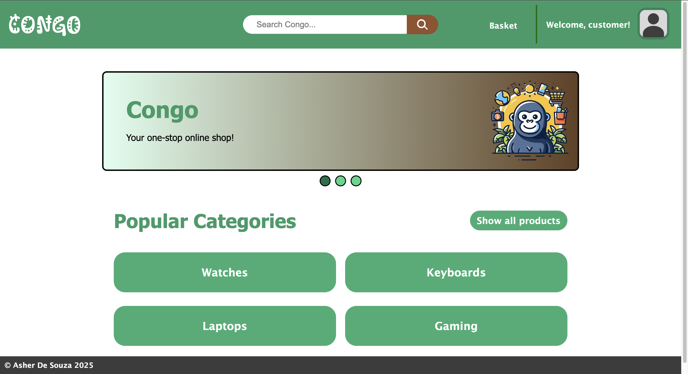

# Congo - Your one-stop online shop!

# https://congo-app.vercel.app/

#### For the Enterprise Software Engineering Module at Ada

# Disclaimer

At the time of submission, not all intended features made it into the final product, and some features are working locally but not on the live application.

- In the live webapp, it's not possible to view items that have been added to the basket, meaning that you cannot checkout as well. This is due to a bug discovered late in development but too close to the deadline to resolve. The webapp works as expected when running the site locally, as evidenced in the video.
- I also intended to add user login and registration to the app but was unable to due to time constraints. However, I will discuss briefly some of the decisions that I would have made during development if I had added login/registration.

# Introduction

## Solution Overview

This is a [Next.js](https://nextjs.org) project bootstrapped with [`create-next-app`](https://nextjs.org/docs/app/api-reference/cli/create-next-app). It is a lightweight e-commerce site which allows users to browse for items via either predefined shortcuts or by using the search bar. From a results page, users can browse through a variety of items and add them to a basket. From the basket page, users are able to access a mock checkout window.

## Project Aim & Objectives

The main goal of Congo is to allow people to browse for the products they want at an affordable price, while also keeping their user data safe and providing them with a frictionless user experience.

Key objectives:

- Implement real-time server calls
- A dynamic search feature that allows users to find products related to what they are searching for
- Streamlined user interface
- Keeping user data safe

# Enterprise Considerations

### Performance

To ensure that the application was performant, I ensured that functions which sent API calls to the middleware in the backend repository were lean. This means that the functions each had one purpose (Create, Read, Update, or Destroy) as opposed to a few larger functions which take in many parameters and take long to process.

Also, I stored some of the images that I used in the app within the repository itself. This was done to speed up the rendering of some resources that I knew would always be needed.

### Scalability

To ensure that Congo is scalable, I created a `/components` folder and created reusable elements so that parts of the app can be reused again to make new pages, sections or new components.

For the backend, the size of the database used to store items is limited only by Render's hosting costs. For this project, I chose the free tier which offers 1GB of storage and 256MB of RAM. However, if there was an influx of users or of products then additional storage could be purchased to vertically scale the backend effectively.

### Robustness

To ensure that the app could handle errors efficiently and that I could debug any issues, I ensured that most functions incorporated the try/catch method so that if a function failed, then the catch block would be able to handle the error gracefully instead of the application crashing.

This was particularly useful for functions which made calls to the server's API. This is because if the server was down or the call was made incorrectly, then there would be a fallback method. An example of this is the `getBasket` method, which calls `/basket` with a GET request and is expected to return an array containing all the items which the user currently has in their basket. If the server call fails for whatever reason, the `catch` statement returns a blank array `[]` which doesn't cause the server to crash, and can be handled by the basket page seeing that the length of the basket array is 0 and deducing that there are no items in the basket.

### Security

To ensure that people browsing GitHub were not able to see the login details of my database connection or the URL of my hosted backend, I kept those variables safe in a `.env` file, which was not committed to GitHub through the use of the `.gitignore` file.

Additionally, I tried to limit against SQL injection attacks by using the Sequelize ORM (Object Relational Mapping) tool. This was done by using Sequelize's Model methods. They work by parameterising queries so that user input is treated as data, and not as part of the SQL command. The benefit of this is that it adds a layer of abstraction which makes it harder for malicious users to execute commands they're not meant to.

If I had implemented the ability for a user to register/login, I would have used hashing instead of encryption because if a hacker ever got access to the encryption key, they could decrypt all passwords.

I would have hashed passwords before storing them into the database. Hashing is a one-way operation, so even if attackers got the hashed passwords they couldn't do anything with them.
I would have used the bcrypt library to hash passwords as soon as a user inputs them, that way nobody except for the user knows their password. As well as this, to prevent against rainbow table attacks (because hashes can be reversed), I would also have salted each hashed password with a unique salt `(bcrypt.hash(password, 10))` so that each hash is unique, even if two passwords are the same.

# Installation and Usage Instructions

## Prerequisites

To run the app locally and configure it for hosting, you will need the following programs:

- An IDE (VSCode, IntelliJ WebStorm etc.)
- Node.js version 18.18 or later
- A node package manager (npm, yarn etc.)
- A web browser (Chrome, Firefox, Safari etc.)

## Setting up external hosting

The application is hosted by Vercel for the frontend repository, and Render for the backend repository and database. I did this because Next.js is developed by Vercel so my reasoning was that the user experience would be more straightforward.

#### Deploying the PostgreSQL Database

After creating a Render account, I [created a new database](https://dashboard.render.com/new/database) and selected the free tier. Once the database was deployed, I stored the external database URL somewhere safe to be used later.

#### Deploying the Backend repository

I then [deployed a web service](https://dashboard.render.com/web/new) and imported my GitHub repository. After specifying my start command (`node server.js`), I selected the free instance tier. When specifying environment variables, I specified `DATABASE_URL` as the external URL from my PostgreSQL database, and `ALLOWED_ORIGINS` was set as [the live frontend URL](https://congo-app.vercel.app).

#### Deploying the Frontend repository

After logging into Vercel, I allowed it to access to my GitHub repository. Then, it provided me with options to choose my project's name, framework preset, root directory, and most crucially build settings and environment variables.

I setup the repository with `npm run build` and `npm install` as my build and install commands respectively.

For this repository, the only environment variable that I used was `NEXT_PUBLIC_API_URL` which held the URL of my live backend service.

## Running the application locally

Clone this repository and the [backend repository](https://github.com/asherddesouza/congo-ecommerce-backend) using either HTML, SSH or GitHub Desktop. Open both repositories in separate IDE windows, and open terminal sessions for each as well.

To run the frontend app locally, in the frontend repository you must first run `npm install` or `yarn install`, depending on your dev environment. Once dependencies are installed, run `npm run dev` or `yarn dev` to start your local instance of the webpage.

In the backend repository, run `node server.js` to start the development server which the frontend will make API requests to. The middleware for the application is defined in the routes of this repository.

In the frontend repository, I set `NEXT_PUBLIC_API_URL=http://localhost:5000` because that's where the local backend server would be running from.

In the backend repository, I set `DATABASE_URL` as my external database URL and `ALLOWED_ORIGINS` to be "http://localhost:3000" as that's where my local frontend was hosted.

# Feature Overview

# Issues & future enhancements

- could have done caching

# References

ai tools
